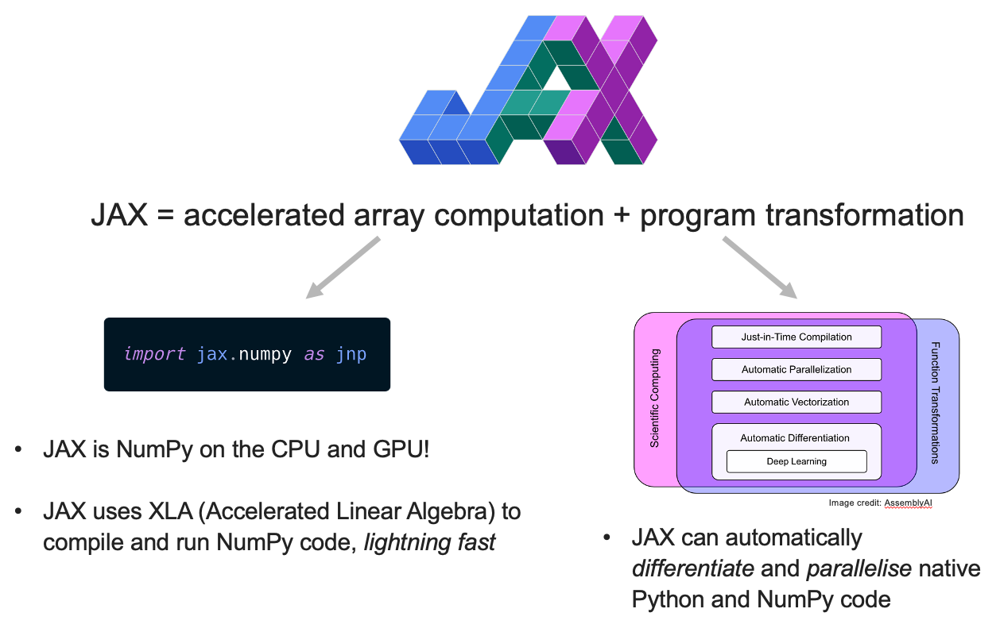

# Introduction to JAX Workshop

    

Heard of [JAX](https://jax.readthedocs.io/en/latest/index.html) but not sure what the fuss is about? 

Keen to learn about how JAX can be used for scientific computing and ML?

JAX is a (relatively) new python library for high-performance scientific computing and ML. 

The goal of this workshop is to:
1) Introduce you to JAX
2) Help you solve any JAX problems you have in your own work
3) Help build a community of JAX users at ETH

# Workshop Overview
[View workshop recording here](https://ethz.zoom.us/rec/share/abYEhXp14QKmXFGS5O_7hAPBMIwguwZ2zXLKvCLqhxVTB0qIhdCPnt2y4UYLRUuK.XmoanYs0XOOj3wkM)

This workshop consists of two parts:
1) Introduction to JAX (suitable for complete beginners)
   - [Student notebook in Collab](https://colab.research.google.com/drive/1GK5TNw8kQ8ThbEWMn5k5XW9cbQdDa2Rw?usp=sharing) (also provided in this repo)
   - [Slides](https://benmoseley.blog/uploads/slides/24_06_Introduction_to_JAX_Workshop.pdf)
3) Advanced Concepts in JAX (solving a more complex scientific problem with JAX)
   - See [CaseStudy](./CaseStudy) folder.
   - [Notebook with programming exercises in Collab](https://colab.research.google.com/drive/1iseBXw9rlMEeRHns7dLHtakTe0wJq9OS).

Held at ETH Zurich, 25 June 2024

Organised by [Ben Moseley](https://github.com/benmoseley), [Paweł Czyż](https://github.com/pawel-czyz)
